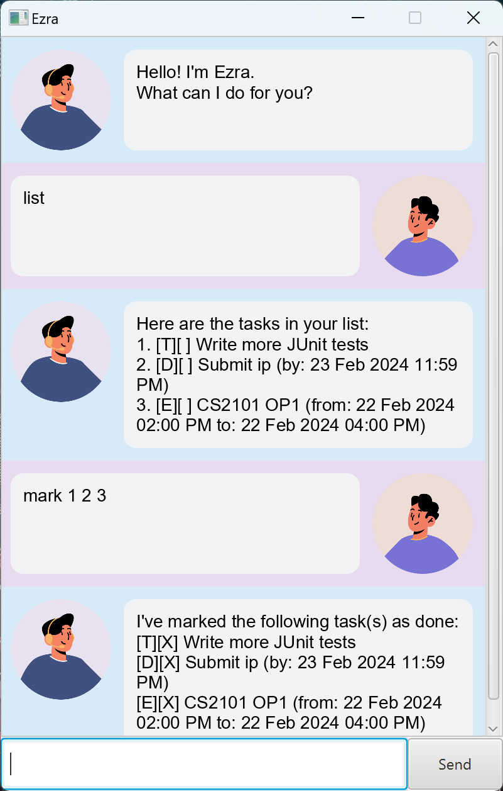

# Ezra User Guide

Ezra is a desktop app for managing your tasks, optimized for use via a Command Line Interface (CLI) while having a chatbot-like Graphical User Interface (GUI). If you can type fast, Ezra can get help you record and update your tasks more efficiently than traditional GUI apps.

- [Quick Start](https://tanzhiheng26.github.io/ip/#quick-start)
- [Features](https://tanzhiheng26.github.io/ip/#features)
  - [Adding a **ToDo** task: `todo`](https://tanzhiheng26.github.io/ip/#adding-a-todo-task-todo)
  - [Adding a **Deadline** task: `deadline`](https://tanzhiheng26.github.io/ip/#adding-a-deadline-task-deadline)
  - [Adding an **Event** task: `event`](https://tanzhiheng26.github.io/ip/#adding-an-event-task-event)
  - [Listing all tasks: `list`](https://tanzhiheng26.github.io/ip/#listing-all-tasks-list)
  - [Marking tasks as done: `mark`](https://tanzhiheng26.github.io/ip/#marking-tasks-as-done-mark)
  - [Marking tasks as not done: `unmark`](https://tanzhiheng26.github.io/ip/#marking-tasks-as-not-done-unmark)
  - [Deleting tasks: `delete`](https://tanzhiheng26.github.io/ip/#deleting-tasks-delete)
  - [Finding tasks by keyword: `find`](https://tanzhiheng26.github.io/ip/#finding-tasks-by-keyword-find)
  - [Undoing a command: `undo`](https://tanzhiheng26.github.io/ip/#undoing-a-command-undo)

## Quick Start

1. Ensure you have Java 11 or above installed in your Computer.
2. Download the latest ezra.jar from [here](https://github.com/Tanzhiheng26/ip/releases)
3. Copy the file to the folder you want to use as the _home folder_ for Ezra.
4. Double-click on the jar file to launch the application. A GUI similar to the screenshot above should appear in a few seconds

## Features

### Adding a **ToDo** task: `todo`
Adds a ToDo to the list of tasks.

Format: `todo <description>`

Examples:
- `todo return books`
- `todo buy milk`

### Adding a **Deadline** task: `deadline`
Adds a Deadline to the list of tasks.

Format: `deadline <description> /by <date time>`

Examples:
- `deadline return books /by 29/01/2024 1800`
- `deadline submit assignment /by 16/02/2024 1200`

### Adding an **Event** task: `event`
Adds an Event to the list of tasks.

Format: `event <description> /from <date time> /to <date time>`

Examples:
- `event CS2103T briefing /from 16/02/2024 1600 /to 16/02/2024 1700`
- `event project meeting /from 18/02/2024 2100 /to 18/02/2024 2200`

### Listing all tasks: `list`
Shows a list of all the tasks.

Format: `list`

### Marking tasks as done: `mark`
Marks ones or more existing tasks as done.

Format: `mark <existing task numbers>`

Examples:
- `mark 1`
- `mark 2 4 6`
- `mark 3 2 1`

### Marking tasks as not done: `unmark`
Marks ones or more existing tasks as not done.

Format: `unmark <existing task numbers>`

Examples:
- `unmark 1`
- `unmark 2 4 6`
- `unmark 3 2 1`

### Deleting tasks: `delete`
Deletes ones or more existing tasks from the list of tasks.

Format: `delete <existing task numbers>`

Examples:
- `delete 1`
- `delete 2 4 6`
- `delete 3 2 1`

### Finding tasks by keyword: `find`
Finds existing tasks that contains the keyword.

Format: `find <keyword>`

Examples:
- `find book`
- `find CS2103T`
- `find project meeting`

### Undoing a command: `undo`
Undoes the previous command that is not `list` / `find` / `undo`.

Format: `undo`

Example: Executing `delete 1` -> `list` -> `undo` restores the task that was deleted.
